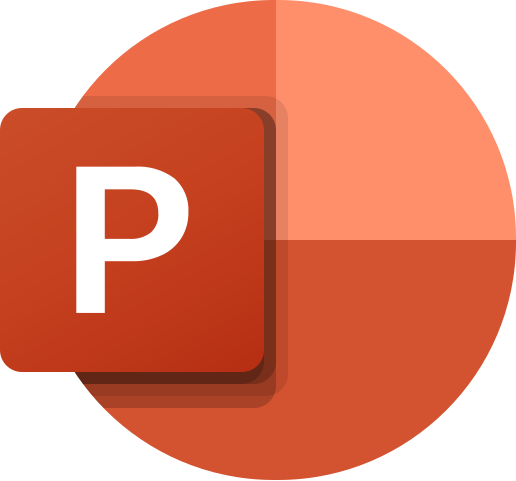

## Hi there 👋

My name is Timofey, and welcome to my GitHub profile!

This is my new account, where I will be showcasing my projects and skills.  
I'm currently expanding my knowledge in programming and 3D development.

---

## Computer Skills

### Good Knowledge

  
  
  

### Basic Knowledge

  
  
  
  
  

